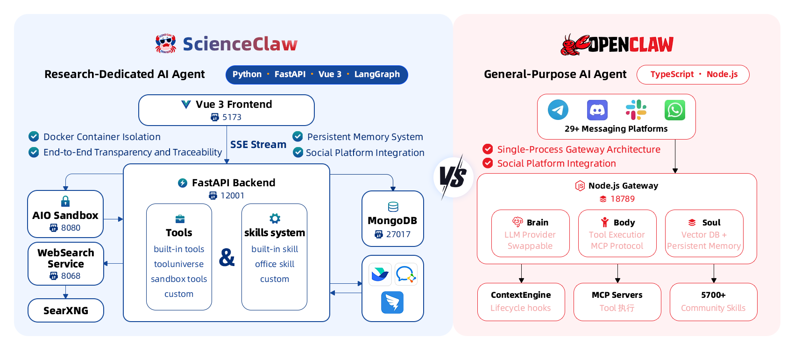

<div align="center">

<h1>&nbsp;RpaClaw</h1>

**[English](README.md)** | **[中文](README_zh.md)**

</div>

RpaClaw is a privacy-first personal assistant with RPA (Robotic Process Automation) capabilities, built on [LangChain DeepAgents](https://github.com/langchain-ai/deepagents) and [AIO Sandbox](https://github.com/agent-infra/sandbox) infrastructure. It offers 1,900+ built-in tools, multi-format document generation, sandboxed code execution, and browser automation recording.

<div align="center">

*RPA Recording & Playback · 1,900+ Built-in Tools · Multi-format Generation · Fully Local & Privacy-First*

[](./Tools) [](./Skills) [](./RpaClaw/frontend) [](./RpaClaw/backend) [](./RpaClaw/task-service) [](./RpaClaw/sandbox) [](LICENSE)

---

[Why RpaClaw](#why-rpaclaw) · [Architecture](#architecture) · [News](#news) · [Quick Start](#quick-start) · [Local Setup](#local-setup) · [Free API Credits](#free-api-credits) · [Tools & Skills](#tools-skills) · [Features](#practical-features) · [Project Structure](#project-structure) · [Commands](#commands) · [Community](#community) · [Acknowledgements](#acknowledgements)

</div>

---

<a id="why-rpaclaw"></a>

## ✨ Why RpaClaw

<table>
<tr>
<td width="37%" valign="top">

### 🤖 RPA Recording & Automation

Record browser interactions and generate **Playwright scripts** automatically. RpaClaw captures your actions, generates smart locators, and creates reusable automation skills. Supports both Docker sandbox mode and local mode for flexible deployment.

</td>
<td width="32%" valign="top">

### 🔒 Security First

Runs entirely in **Docker containers** with isolated sandbox execution. The agent cannot access your host system or personal files. All data stays in local `./workspace` directory — nothing uploaded to external servers. Deploy with confidence.

</td>
<td width="31%" valign="top">

### 🚀 Ready Out of the Box

No tedious configuration needed. Launch with **a single command** using pre-built Docker images. 1,900+ tools and skill packages included. Whether you're automating workflows or building AI agents, get started immediately.

</td>
</tr>
</table>

---

<a id="architecture"></a>

## 🏗️ Architecture

<div align="center">

</div>

---

<a id="news"></a>

## 📢 News

- **[2026-03-13]** RpaClaw v0.0.1 is officially released! Visit our website: [rpaclaw.taichuai.cn](https://rpaclaw.taichuai.cn/)

---

<a id="quick-start"></a>

## 📦 Quick Start

### Docker Deployment (Recommended)

#### Prerequisites

- [Docker](https://docs.docker.com/get-docker/) & [Docker Compose](https://docs.docker.com/compose/install/) (Docker Desktop includes Compose)
- Recommended system RAM ≥ 8 GB

#### Install & Launch

**1. Clone the repository**

```bash
git clone https://github.com/AgentTeam-TaichuAI/RpaClaw.git
cd RpaClaw
```

**2. Pull pre-built images and start**

```bash
docker compose -f docker-compose-release.yml up -d
```

> Pulls pre-built images directly — no local compilation needed. Ready in a few minutes.

**3. Open in browser**

```
http://localhost:5173
```

**4. Login**

Default admin username: `admin`

> ⚠️ Please set your password on first login.

---

### 🛠️ Developers — Build from Source

```bash
docker compose up -d --build
```

> Builds all images from source code. Ideal for developers who need to modify the code.

---

<a id="local-setup"></a>

## 🖥️ Local Development Setup

For developers who want to run services locally without Docker:

### Prerequisites

- Python 3.13+
- Node.js 18+
- MongoDB (optional, for database features)
- Redis (optional, for task scheduling)

### Backend Setup

**1. Navigate to backend directory**

```bash
cd RpaClaw/backend
```

**2. Create and configure environment**

```bash
cp .env.example .env
```

**3. Edit `.env` file with your configuration:**

```bash
# LLM Configuration
DS_API_KEY=your_deepseek_api_key
DS_URL=https://api.deepseek.com
DS_MODEL=deepseek-chat

# Storage Mode: 'local' or 'docker'
STORAGE_BACKEND=local

# MongoDB (optional - only needed for user management and sessions)
MONGODB_HOST=localhost
MONGODB_PORT=27017
MONGODB_USER=
MONGODB_PASSWORD=

# Sandbox (for Docker mode RPA)
SANDBOX_MCP_URL=http://localhost:18080/mcp

# Skills and Workspace
EXTERNAL_SKILLS_DIR=./Skills
BUILTIN_SKILLS_DIR=./builtin_skills
WORKSPACE_DIR=./workspace
```

**4. Install dependencies and run**

```bash
# Using uv (recommended)
uv run uvicorn main:app --host 0.0.0.0 --port 8000

# Or using pip
pip install -r requirements.txt
python -m uvicorn main:app --host 0.0.0.0 --port 8000
```

### Frontend Setup

**1. Navigate to frontend directory**

```bash
cd RpaClaw/frontend
```

**2. Install dependencies**

```bash
npm install
```

**3. Run development server**

```bash
npm run dev
```

**4. Open browser**

```
http://localhost:5173
```

### RPA Modes

#### Local Mode (No Docker Required)

Set `STORAGE_BACKEND=local` in `.env`. RPA recording uses CDP (Chrome DevTools Protocol) screencast instead of VNC. Playwright runs directly on your host machine.

**Advantages:**
- No Docker sandbox needed
- Faster performance
- Direct access to host browser

**Limitations:**
- Less isolation
- Requires Playwright installation on host

#### Docker Mode (Sandbox Isolation)

Set `STORAGE_BACKEND=docker` in `.env`. Requires sandbox container running. RPA uses VNC for display.

**Advantages:**
- Full isolation
- Consistent environment
- Safer execution

**Requirements:**
- Sandbox container must be running
- Access to `SANDBOX_MCP_URL`

---

<a id="free-api-credits"></a>

## 🎁 Free LLM API Credits for Early Users

To lower the barrier for new users, a limited batch of LLM API resources:

| Offer | Details |
|---|---|
| SCNet (National Supercomputing Internet) | **10M free tokens** ([Claim here](https://www.scnet.cn/ui/mall/en)) |
| Zidong Taichu Cloud | **10M free tokens** ([Claim here](https://gateway.taichuai.cn/modelhub/apply)) |

> Limited availability — first come, first served. We will continue to secure more compute resources for the community.

---

<a id="tools-skills"></a>

## 🔧 Tools & Skills System

### 🧪 1,900+ Built-in Tools

RpaClaw integrates **ToolUniverse**, providing 1,900+ tools across multiple domains for automation, data processing, and AI-powered workflows.

### 🛠️ Four-Layer Tool Architecture

| Layer | Description | Examples |
|---|---|---|
| 🔧 **Built-in Tools** | Core search & crawl capabilities | `web_search`, `web_crawl` |
| 🧪 **ToolUniverse** | 1,900+ scientific tools, ready to use | UniProt, OpenTargets, FAERS, PDB, ADMET, etc. |
| 📦 **Sandbox Tools** | File operations & code execution | `read_file`, `write_file`, `execute`, `shell` |
| 🛠️ **Custom @tool** | User-defined Python functions, hot-loaded from `Tools/` | Your own tools |

### 🎨 Custom Tools

RpaClaw makes it easy to extend with your own tools:

- **Natural language creation** — Simply describe what you want in chat, and the agent will create, test, and save a new tool for you automatically.
- **Manual mounting** — Drop any Python file with `@tool` decorated functions into the `Tools/` directory; they are auto-detected and hot-loaded without restart.

### 🧠 Skill System

Skills are **structured instruction documents (SKILL.md)** that guide the Agent through complex, multi-step workflows. Unlike tools (executable code), skills act as the Agent's "playbook" — defining strategies, rules, and best practices.

#### Built-in Skills

| Skill | Purpose |
|---|---|
| 🤖 **RPA Recording** | Record browser interactions and generate Playwright automation scripts |
| 📄 **pdf** | Read, create, merge, split, OCR, and generate PDF documents |
| 📝 **docx** | Create and edit Word documents with formatting, tables, and charts |
| 📊 **pptx** | Generate and edit PowerPoint presentations |
| 📈 **xlsx** | Create and manipulate Excel spreadsheets, process CSV/TSV data |
| 🛠️ **tool-creator** | Create custom @tool functions (write → test → save) |
| 📝 **skill-creator** | Create and refine skills with iterative workflow |
| 🔍 **find-skills** | Search and install community skills |
| 🧪 **tooluniverse** | Access to 1,900+ built-in tools |

#### Multi-Format Document Generation

RpaClaw can produce professional documents in **4 formats**:

| Format | Features |
|---|---|
| **PDF** | Cover page, table of contents, charts, citations, references |
| **DOCX** | Cover page, TOC, tables, images, Word-native formatting |
| **PPTX** | Slide decks with titles, bullet points, images, speaker notes |
| **XLSX** | Data tables, charts, multi-sheet workbooks, CSV/TSV export |

#### Custom Skills

- **Natural language creation** — Describe your workflow in chat, and the agent will draft, test, and save a new skill for you.
- **Manual installation** — Place a folder with a `SKILL.md` file into the `Skills/` directory. The agent automatically matches and loads relevant skills based on user intent.
- **Community ecosystem** — Discover and install skills from the open community with the built-in `find-skills` capability.

---

<a id="practical-features"></a>

## 💡 Practical Features

| Feature | Description |
|---|---|
| 🤖 **RPA Recording & Playback** | Record browser interactions and generate reusable Playwright automation scripts. Supports both Docker sandbox mode and local mode. |
| 📨 **Feishu (Lark) Integration** | Configure webhook notifications in settings — receive task results and alerts directly in Feishu group chat. |
| ⏰ **Scheduled Tasks** | Set up recurring or one-time tasks with cron-like scheduling. Results delivered via Feishu or in-app notifications. |
| 📁 **File Management** | Built-in file panel for browsing, previewing, and downloading workspace files generated during sessions. |
| 📊 **Resource Monitoring** | Real-time dashboard showing LLM resource consumption and service health status. |

---

<a id="project-structure"></a>

## 📂 Project Structure

```
RpaClaw/
├── docker-compose.yml              # Development orchestration
├── docker-compose-release.yml      # Pre-built image orchestration
├── images/                         # Static assets (logo, screenshots)
├── Tools/                          # Custom tools (hot-reload)
├── Skills/                         # User & community skill packages
├── workspace/                      # 🔒 Local workspace (data stays local)
└── RpaClaw/
    ├── backend/                    # FastAPI backend
    │   ├── deepagent/              # Core AI agent engine (LangGraph)
    │   ├── builtin_skills/         # Built-in skills (pdf, docx, pptx, xlsx, etc.)
    │   ├── rpa/                    # RPA recording/playback engine
    │   ├── route/                  # REST API routes
    │   ├── im/                     # IM integrations (Feishu/Lark)
    │   ├── mongodb/                # Database access layer
    │   └── user/                   # User management
    ├── frontend/                   # Vue 3 + Tailwind frontend
    ├── sandbox/                    # Isolated code execution environment
    ├── task-service/               # Scheduled task service
    └── websearch/                  # Search & crawl microservice
```

---

<a id="commands"></a>

## 🧑‍💻 Useful Commands

```bash
# Pull pre-built images and start (recommended for most users)
docker compose -f docker-compose-release.yml up -d

# Build from source and start (for developers)
docker compose up -d --build

# Daily launch — fast startup, no rebuild
docker compose up -d

# Check service status
docker compose ps

# View logs (-f to follow in real time)
docker compose logs -f backend
docker compose logs -f frontend
docker compose logs -f sandbox

# Restart a service
docker compose restart backend

# Stop all services
docker compose down

# Stop a single service
docker compose stop backend
```

---

## 🗑️ Uninstall

RpaClaw is built entirely on Docker, so uninstalling it is clean and simple — it has **no side effects on your host system**.

```bash
# Stop and remove all containers
docker compose down

# (Optional) Remove downloaded images to free up disk space
docker compose down --rmi all --volumes
```

Then simply delete the project folder:

```bash
rm -rf /path/to/RpaClaw
```

That's it. No residual files, no registry entries, no system-level changes.

---

## 🏛️ Built By

**Zhongke Zidong Taichu (Beijing) Technology Co., Ltd.**

---

<a id="community"></a>

## 🤝 Community

We welcome contributions, feedback, and discussions! Join our community:

- Submit issues and feature requests via [GitHub Issues](https://github.com/AgentTeam-TaichuAI/RpaClaw/issues)
- Share your custom tools and skills with the community

---

## 📄 License

[MIT License](LICENSE)

---

<a id="acknowledgements"></a>

## 🙏 Acknowledgements

RpaClaw is built on the shoulders of excellent open-source projects. We would like to express our sincere gratitude to:

- **[LangChain DeepAgents](https://github.com/langchain-ai/deepagents)** — The batteries-included agent harness built on LangChain and LangGraph. RpaClaw's core agent engine is powered by the DeepAgents architecture, which provides planning, filesystem access, sub-agent delegation, and smart context management out of the box.

- **[AIO Sandbox](https://github.com/agent-infra/sandbox)** — The all-in-one agent sandbox environment that combines Browser, Shell, File, and MCP operations in a single Docker container. RpaClaw relies on AIO Sandbox to provide secure, isolated code execution with a unified file system.

- **[ToolUniverse](https://github.com/ZitnikLab/ToolUniverse)** — A unified ecosystem of 1,900+ scientific tools developed by the Zitnik Lab at Harvard. ToolUniverse powers RpaClaw's multi-disciplinary research capabilities across drug discovery, genomics, astronomy, earth science, and more.

- **[SearXNG](https://github.com/searxng/searxng)** — A privacy-respecting, hackable metasearch engine. RpaClaw uses SearXNG as the backbone of its `web_search` tool, aggregating results from multiple search engines without tracking.

- **[Crawl4AI](https://github.com/unclecode/crawl4ai)** — An open-source, LLM-friendly web crawler. RpaClaw's `web_crawl` tool is powered by Crawl4AI, enabling intelligent content extraction from web pages for research and analysis.

---

## ⭐ Star History

<div align="center">

[](https://star-history.com/#AgentTeam-TaichuAI/RpaClaw&Date)

</div>

## Contributors

- [Zhiyuan Li](https://github.com/Zhiyuan-Li-John)
- [Guangchuan Guo](https://github.com/meizhuhanxiang)
- [Shaoling Lin](https://github.com/SharryLin)
- [Songsong Lei](https://github.com/slei)
- [Zhidong Zhang](https://github.com/mumudd)

**Technical Support:** NLP Group, Institute of Automation, Chinese Academy of Sciences

