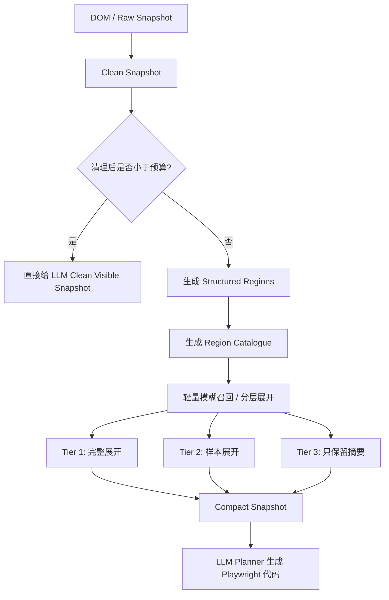

# RPA Snapshot 压缩与 Structured Regions 设计

## 1. 背景

本设计源自一次本地 E2E 录制问题：

- 页面：`http://127.0.0.1:4173/detail.html`
- 用户指令：`提取单据基本信息各个字段的名称与值`
- 实际输出误提取为采购明细表：

```json
{
  "商品名称": "数量",
  "ThinkPad T14 开发笔记本": "3",
  "27 寸扩展显示器": "3"
}
```

页面真实 DOM 中存在目标数据：

```text
单据基本信息
购买人：李雨晨
使用部门：研发效能组
验收人：张雪
供应商：联想华南直营服务中心
期望到货：2026-04-18
```

根因不是 Playwright 无法提取，也不是页面没有数据，而是当前给 LLM Planner 的 compact snapshot 没有有效表达“单据基本信息”这个 label-value 区域。Planner 没看见目标区域，只能按经验尝试 `dt/dd` 和全局 `table`，最终误选了“采购明细”表格。

## 2. 当前快照机制

当前代码里存在两套 DOM 观察方式。

### 2.1 旧的交互元素抽取

旧抽取器主要扫描：

```text
a, button, input, textarea, select, [role=button], [role=link], ...
```

它适合：

- click
- fill
- navigate
- select

但它不适合静态业务数据提取。业务字段常见结构是：

```html
<span class="field-label">购买人</span>
<span class="field-value" data-field="requestor">李雨晨</span>
```

这类 `span` 不是按钮、链接或输入框，因此容易被旧抽取器漏掉。

### 2.2 Snapshot V2 语义快照

Snapshot V2 已经开始采集：

- `actionable_nodes`
- `content_nodes`
- `containers`

它方向更接近页面语义理解，但当前 compact snapshot 主要仍消费旧的 `frame.elements`。`content_nodes` 和 `containers` 没有真正成为 extract 任务的主上下文。

实际效果是：完整 snapshot 已经比过去丰富，但 planner 看到的 compact payload 仍然偏交互元素和少量集合线索。

## 3. 第一性目标

本次设计的第一性目标不是“精确预测用户唯一想要的区域”，而是：

> 在上下文预算内，尽可能避免用户可能需要的数据在压缩阶段被排除。

因此压缩层不应该替代 LLM 做最终语义决策。压缩层只负责：

- 清理明显无用内容；
- 提炼页面业务结构；
- 控制上下文预算；
- 对可能相关的区域做保守展开；
- 保留全页面区域目录，避免 planner 误以为页面只有一个数据区。

## 4. 已否决方案

### 4.1 直接给完整 DOM 或全部 content_nodes/containers

否决原因：

- 上下文膨胀；
- 噪声变多；
- LLM 容易被导航、按钮、重复区域、长表格干扰；
- 成本和延迟增加；
- 本质上把压缩问题甩给 LLM，没有解决快照设计问题。

### 4.2 继续只暴露交互元素和表格线索

否决原因：

- 对 click/fill 有用，但对 extract 静态业务字段不够；
- `span.field-label + span.field-value` 这类展示型字段会被漏掉；
- LLM 容易退化成经验式 DOM 扫描；
- 当前 bug 正是该问题的直接表现。

### 4.3 复杂规则解析用户指令并计算精确分数

例如：

```text
动作词识别 -> 目标短语抽取 -> 意图分类 -> 加权打分 -> 选 Top-K
```

否决原因：

- 容易演化成规则驱动 Agent；
- 用户口语表达、错别字、同义表达很多，复杂规则不稳；
- 评分公式容易变成玄学；
- 不同评分项互相稀释时，会出现“明明标题命中，但总分仍偏低”的问题；
- 这偏离了“避免漏掉可能相关区域”的第一性目标。

### 4.4 默认每次让 LLM 先选择 region

否决原因：

- 多一次 LLM 调用，录制体验变慢；
- 成本增加；
- 不稳定性叠加；
- 如果 region 很多，第一次 LLM 判断同样会遇到上下文预算问题；
- 它可以做兜底，但不适合作为默认主路径。

### 4.5 第一版引入 embedding 或向量数据库

否决原因：

- 当前页面 region 是短生命周期数据，通常数量不大，不需要落库；
- embedding 需要模型、tokenizer、运行时和缓存策略；
- 端侧部署复杂度增加；
- 对“提取单据基本信息中的信息”这类强字面重叠场景，字符 n-gram 已足够；
- 向量检索可以后续作为语义增强，但不应成为第一版主路径。

## 5. 推荐方案：预算驱动的保守展开

推荐方案不是精确选择一个 region，而是按预算决定每个 region 展开多少。

```text
强相关区域：完整展开
可能相关区域：样本展开
低相关区域：只保留摘要
```

重要边界：

- 所有 region 尽量进入 catalogue；
- 召回逻辑只影响展开粒度，不负责最终业务判断；
- 最终提取策略仍由 LLM Planner 基于 compact snapshot 生成；
- 规则只做信息预算分配，不做 Agent 决策。

## 6. 整体流程



## 7. 数据结构

### 7.1 Clean Snapshot

Clean Snapshot 是从 DOM / raw snapshot 清理出的可见页面事实。

应清理：

- `script`
- `style`
- 大段 CSS
- 隐藏节点
- 明显无意义的 SVG path
- 事件属性
- 过长的随机 class/id/hash 噪声

如果清理后的数据量小于预算阈值，直接给 LLM，不进入细粒度结构压缩。

### 7.2 Structured Regions

Structured Regions 把元素列表提炼为业务区域。

示例：

```json
{
  "region_id": "r2",
  "kind": "label_value_group",
  "title": "单据基本信息",
  "heading": "PR 单核心字段",
  "summary": "购买人 李雨晨 使用部门 研发效能组 验收人 张雪...",
  "data_shape": {
    "field_count": 5,
    "sample_pairs": [
      {"label": "购买人", "value": "李雨晨"},
      {"label": "使用部门", "value": "研发效能组"}
    ]
  },
  "locator_hint": "section:has-text('单据基本信息')"
}
```

第一阶段支持的 region 类型：

- `label_value_group`
- `table`
- `action_group`
- `text_section`

后续可以扩展：

- `form`
- `card_list`
- `navigation`
- `tree`
- `dialog`

### 7.3 Region Catalogue

Region Catalogue 是全页面区域目录。它应该尽量保留所有区域的短摘要。

示例：

```json
{
  "regions": [
    {
      "region_id": "r1",
      "kind": "action_group",
      "summary": "返回首页 查看采购明细 eBuy 填单"
    },
    {
      "region_id": "r2",
      "kind": "label_value_group",
      "title": "单据基本信息",
      "summary": "购买人 李雨晨 使用部门 研发效能组..."
    },
    {
      "region_id": "r3",
      "kind": "table",
      "title": "采购明细",
      "summary": "商品名称 数量 使用人"
    }
  ]
}
```

Catalogue 的作用是让 LLM 知道页面还有哪些区域，避免因为只看到展开区域而误判页面结构。

## 8. 分层展开策略

不使用复杂加权公式。第一版只做简单 Tier：

### Tier 1：强相关，完整展开

满足任一条件即可进入 Tier 1：

- 用户原句和 region `title/heading` 有明显字符重叠；
- 字符 bigram/trigram 相似度较高；
- extract 指令与明显数据区高度吻合，且该 region 是页面中少数数据区之一。

### Tier 2：可能相关，样本展开

满足任一条件即可进入 Tier 2：

- 用户原句和 region `summary/sample_labels/headers` 有部分重叠；
- extract 类任务下的 `label_value_group`、`table`、`text_section`；
- region 与 Tier 1 邻近，且属于同一业务页面主体。

### Tier 3：低相关，只保留摘要

典型包括：

- 操作按钮区；
- 顶部导航；
- 页脚；
- 与 extract 任务弱相关的纯 action 区。

Tier 3 不默认丢弃，只保留摘要。

## 9. 字符 n-gram 模糊召回

第一版使用中文字符 bigram/trigram 做轻量模糊召回。

它不做最终语义判断，只影响展开粒度。

时间复杂度：

```text
O(Q + N * R)
```

其中：

- `Q` 是用户指令长度；
- `N` 是 region 数量；
- `R` 是 region 摘要长度。

实际页面中通常是毫秒级，远低于 embedding 推理或 LLM 调用。

能力边界：

- 擅长处理字面重叠、漏字、轻微错别字；
- 不擅长处理完全同义但无字面重叠的表达；
- 同义召回问题可作为后续 embedding rerank 的适用场景。

## 10. LLM 兜底策略

不默认触发 LLM region selection。

只有满足以下条件时才考虑：

```text
清理后超过预算
+ region 数量很多
+ 没有明显 Tier 1
+ 直接展开 Top regions 仍会超预算
```

此时给 LLM 的不是完整 DOM，而是 Region Catalogue，让它选择需要展开的 region。

## 11. 本次页面的理想 Compact Snapshot

对于指令：

```text
提取单据基本信息中的信息
```

理想 compact snapshot：

```json
{
  "expanded_regions": [
    {
      "region_id": "r2",
      "kind": "label_value_group",
      "title": "单据基本信息",
      "heading": "PR 单核心字段",
      "pairs": [
        {"label": "购买人", "value": "李雨晨", "value_locator": "[data-field='requestor']"},
        {"label": "使用部门", "value": "研发效能组", "value_locator": "[data-field='department']"},
        {"label": "验收人", "value": "张雪", "value_locator": "[data-field='acceptanceOwner']"},
        {"label": "供应商", "value": "联想华南直营服务中心", "value_locator": "[data-field='supplier']"},
        {"label": "期望到货", "value": "2026-04-18", "value_locator": "[data-field='deadline']"}
      ]
    }
  ],
  "sampled_regions": [
    {
      "region_id": "r3",
      "kind": "table",
      "title": "采购明细",
      "headers": ["商品名称", "数量", "使用人"],
      "sample_rows": [["ThinkPad T14 开发笔记本", "3", "李雨晨"]]
    }
  ],
  "region_catalogue": [
    {"region_id": "r1", "kind": "action_group", "summary": "返回首页 查看采购明细 eBuy 填单"},
    {"region_id": "r2", "kind": "label_value_group", "title": "单据基本信息"},
    {"region_id": "r3", "kind": "table", "title": "采购明细"}
  ]
}
```

这样 planner 能看到：

- `单据基本信息` 是字段组；
- `采购明细` 是表格；
- 当前指令更可能对应字段组；
- 表格不是唯一数据区域。

## 12. 与 AGENTS.md 军规的关系

该方案不违背“禁止经验规则驱动 Agent”的军规，因为：

- 规则不替代 Planner/LLM 做最终语义理解；
- 规则不强制改写执行策略；
- 规则不基于站点经验；
- 规则只做上下文预算分配和保守召回；
- 所有 region 尽量保留在 catalogue，避免压缩层过早裁决。

应明确设计边界：

> 压缩层只决定信息呈现粒度，不决定用户真实意图；最终提取策略仍由 LLM Planner 基于 compact snapshot 生成。

## 13. 第一阶段实现范围

第一阶段只实现：

1. Clean Snapshot 预算判断。
2. Structured Regions 基础类型：
   - `label_value_group`
   - `table`
   - `action_group`
   - `text_section`
3. Region Catalogue。
4. 字符 n-gram 模糊召回分层。
5. Compact Snapshot 输出：
   - `expanded_regions`
   - `sampled_regions`
   - `region_catalogue`
6. 不做提取后硬校验。
7. 不引入 embedding。
8. 不引入向量数据库。

## 14. 后续扩展

后续如果验证发现需要，可以再考虑：

1. 内存 embedding rerank，用于处理同义但无字面重叠的 region 召回。
2. LLM region selection 兜底，用于大页面、低置信、超预算场景。
3. 提取后轻量一致性诊断，用于提示错误区域风险，但不作为第一版硬拦截。
4. 长期经验库或跨页面记忆，再考虑 SQLite/Postgres 向量检索。

